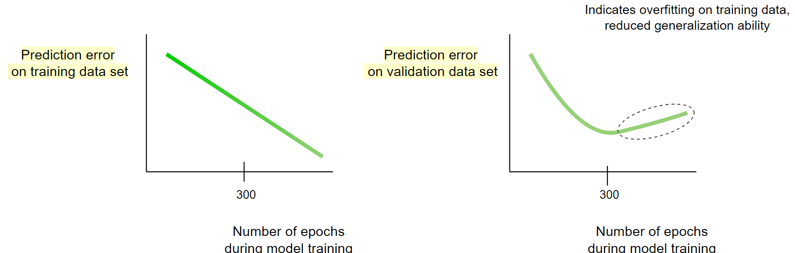
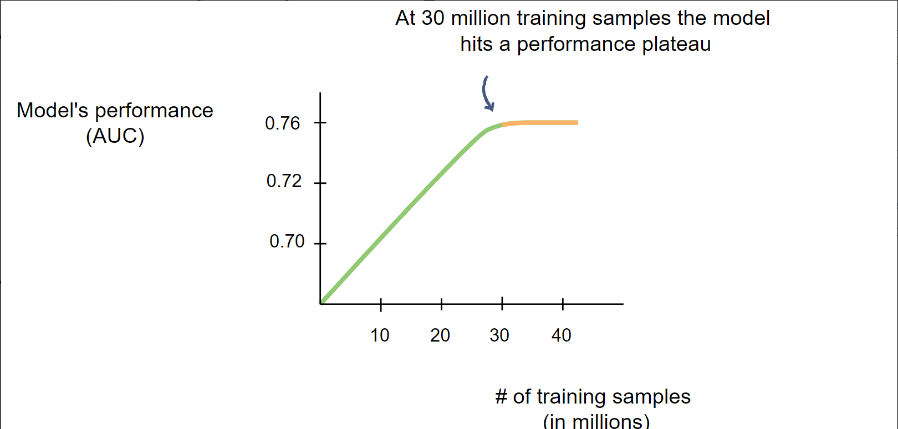
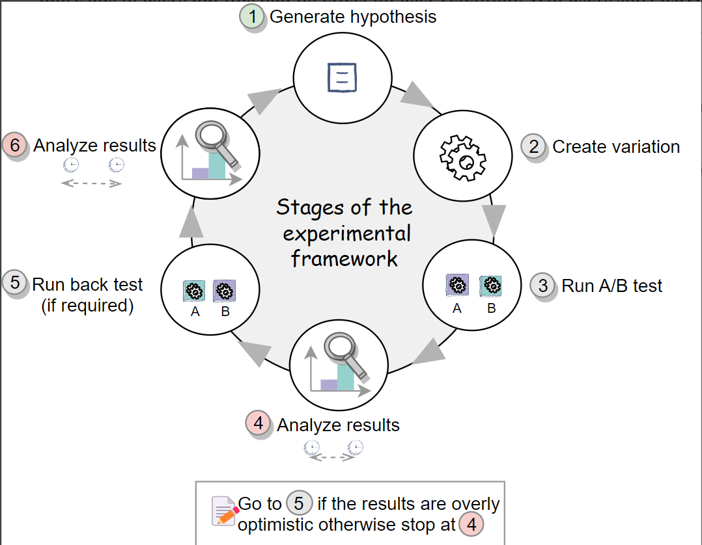

# Grokking the Machine Learning Interview

## The rise of Machine Learning
ML is used at several areas like speech understanding, visual understansing, search ranking, fraud detection

## ML interview expectation

  

## Setting up ML system
- Setting up problem
  - Narrow the problem space
  - chalk out the requiements of the system
For e.g.
> PS: "Design a search engine to display most relevant results in response to user's queires".

Probe: What kind of queries can it answer? What kind of search is it? Generic or specialized?

> PS: "Build a generic search engine that returns relevant results for queries like “Richard Nixon”, “Programming languages” etc."

Probe: How is the feed currently displayed and how can can it be improved?

> PS: "Given a list of tweets, train an ML model that predicts the probability of engagement of tweets and orders them based on that score."

- Understanding scale and latency requqirements
  - Latency : "How fast do we want the results to the query"
  - Scale : "How many requests per second?", "How many websites to retrieve?"

- Metrics definition
  - Offline metrics
    - Classification: accuracy, logloss, precision, recall, F1 score
    - Search and ranking: NDCG 
  - Online metrics
    - Component wise metrics
    - End-to-end metrics
  
- Architecture design

  

- Scale consideration
  Funnel method can be used to reduce the number of items at every stage, and a complex model can be safely used in final stages.

- Offline model building
  - Train data generation
    - Human labelled data : It is an expensive method
    - Open source datasets
    - Data collection through user interaction with pre-existing systems
  - Feature Engineering
    - Start by pinpointing actors given at hand. For e.g. in case of movie recommendation the actors are logged in user, movies available, context
    - To make features, individually inspect the actors. For e,g, users can give user age, gender, language, etc.
    - Historical engagement between actors can lead to another set of features.
  - Model training
    - In the funnel approach, using the simpler models at the top of the funnel and more complex models at the bottom of the funnel.
    - Pre-trained SOTA for transfer learning
  - Offline evaltuation
    - Train, validation and test split
    - fix on types of models, hyperparamets
    - select top models based on offline metrics selected earlier
- Online Model execution and evaluation
  - Test the top performing models in online environment
  - Online metrics performance decide whether the model is fit to be deployed.
- Iterative model development
  - Debug the model when the online performance does not replicate the offline testing.
  - Monitor the performance of the first version of the model after it has been deployed.

 ## Performance and capacity considerations
 - Capacity considerations to be made during
     - Training : Training data, model capacity
     - Evalaution : serving SLA, model capacity
 - Types of complexities
     - Training : Time taken to train the model
     - Evaluation : Time taken to evaluate input at testing time
     - Sample : Number of examples requried to succesfully learn target function
  - Asymptotc analysis
    - Linear/Logistic regression : Train - O(nfe), Eval - O(f), Best choise to save on train and  evaluation time
    - Neural Networks : Train : NA, Eval - O(fnl1 + nl1nl2 + nl2nl3 .. ). Best choise to solve complex problems and if complexity is not an issue.
    - Decision trees/forest : Train : O(nfn_td), Eval : O(fn_td). It is faster than Deep networks and generalizes well. Should be preferred when training data is scarce and capacity is crucial.
  - Example
    - No. of documents in the search engine to evaluate against a query : 100M = 100 X $10^6$
    - SLA 
      - Performance : Return the results back within given time frame
      - Capacity : Queries per second the system can handle
    - Tree based model :
      - Inference time = $1\mu s$ = 1 X $10^{-6}s$
      - Total for 100M images = 100s
    - Load distribution :
      - Distribute load of one query among 1000 shards
      - Inference time for 100M images - 100 X $10^6$ X 1 X $10^{-6}$ X $10^{-3}$ s = 100ms
    - Deep learning model :
      - Inference time = 1ms = $10^{-3}s$
        - Total time with 1000 shards = 100 X $10^6$ X $10^{-3}$ X $10^{-3}$ s = 100s
        - For unlimited capacity, just add more shards till this numnber is down. But it is not practical
  - Funnel based approach
    In this method we begin with a simpler and fast model to first narrow down our search to small number of items. Then apply the more complex model on limited set of items which reduces the SLA time overall
    - Example :
      - Deep learning on 500 documents with 5 shards : 500 X $10^-3$ X $5^-1$ s = 100ms 

## Training data collection strategies
- Main components of ML system - ML algorithm, Training data, Features
- Quality and quantity of trainig data impact the final performance greatly
- Collection techniques
    - Online data collection :
        - If there is an existing system in place which gives model predictions, then user interaction with those can be treated as training data.          - This can be a rule based or a weak ML system.
        - Ex. Recommendation system, an existing rule based recommender, popularity recommender, region based recommender would be existing. USer's interaction with those can be treated as training data.
    - Offline data collection :
        - Use labellers to generate high quality data
        - Ex. Image segmentation : We need different components of the data to be labelled for this task.
            - Crowdsourcing : Get labels by outsourcing tasks to group of people Works for simpler tasks. Does not work when there are privacy concerns, or there are complex tasks.
            - Specialized labellers : Trained labellers for the speicialized task. Has a high training time for labellers. Might be expensive
            - Open source datasets
    - Additional creative collection strategies
        - Product interation with user generates data automatically.
          - Ex : Pinterest builds
            - Item profile by asking users to save pins in a board labelled by the user
            - User profile by suggesting boards based on existing users
        - Manual expansion
          - Data augmentation
              - For logo detection place the logo on differnt images with varied orientations.
        - GAN based expansion
          - Use GAN models to create examples for subcategories where examples do not exist.
- Train, test and validation splits
    - Training data : Useful to learn the parameters of the model
    - Validation data : Useful to tune the hyperparameters. And to know whether the model performs good because it overfits the training data or it can actually generalize very well. After a certain numnber of iterations when the validation error starts increasing is when the model starts overfitting the train data.

      
    - Test data : Hold out set that the model has not seen at all. It will test the true generalizing capabilities of the model. It is also used for model selection if multiple models have been trained. The outcome of this test will determine if the model will be sent for A/B testing.
- Splits strategies
    - Ratio : 60:20:20 or 70:15:15
    - All splits have all patterns : User pattern throughout the week/year/month.
    - Time based split : Train on historical data. Validate and test on more recent data.
- No. of training examples
    - Plot the performance of the model against the number of examples. After a certain number of examples the performance of the model would not change. That is the optimal number of training examples required to train the model.
      

- Training data filtering
    - Data cleaning : Handling missing data, duplicates, outliers, drop irrelevant features. Remove unuseful patterns identified in the training data.
    - Bias removal :
        - Based on how the dataset is created, there might be some bias introduced in the system.
        - For e.g in online data generation for recommendation system, the movies recommender earlier will be recommeded again as they appeared on the top last time.
        - Employ an explore strategy to remove the bias. In case of online data generation, show a randomized list instead of popular for a small set of users.
    - Boostrapping new items
        - In the system where new items are continuously added, boost the new items artifically.
        - For e.g. in the case of movie recommendations, for the cold start problem of items. Recommend new movies similar to the ones already liked by the user.

# Online Experimentation
ML model's success can be measured through different ways, depending on the underlying application.
- Hypothesis and metrics intution : Hypothesis is a claim that a certain change in model's properties will lead to increase in performance of the model. Online testing will test this claim in a controlled environment.
- A/B test : A different version of the existing system is created which deploys the hypothesis. The original version is called 'control' and the new variant is called as 'variation' or 'experiment'.
    - Null hypothesis - The design change will have no change in the performance of the system.
    - Alternate hypothesis - The design change will have positive effect in the performance of the system.
    - Use stastical analysis to confidently say that the positive impact is stastically significant.
- Measuring resutls : Results need to be statistically signigficant to back up claims of the either hypotheses.
- Computing statistical significance :
    - P-value to determine the statistical significance of tests.
    - Significance level(alpha) - boundary to specify a stastically significant finding. Usually 0.05
    - p values less than alpha : The result of test is significant. Reject null hypothesis.
    - p value greater than alpha : The result of test is not significant. Fail to reject null hypothesis.
- Measuring long term effects
- Back testing : Conduct a B/A test and ensure that if there was a gain of x% in A/B test, there is x% loss in B/A test.
- Long running A/B tests : In a short running experiment we might see gains but in long term that change might cause loss in some other areas. For e.g. if we show more ads to users in ad recommendation platform, in short term there might be increase in revenue. But in long term users might start leaving the platform since too many ads are being show. A long running A/B test can be performed. A long running backtest can be used as well.

  

# Embeddings
Using embeddings we can encode an entity into a N-dimensional vector, while capturing the semantics. 

- Text embeddings
    - Word2vec : Dense word embedding learnt by providing a contextual window of N nearby words in the sequence to a neaural network. The hidden layer output for each work corresponds to the word embeddings. The words are represented a BOW in this neural network
        - CBOW : Predict the current word, given the n/2 preceding words and n/2 succeding words as input.
        - n-grams : Predict the n/2 preciding words and n/2 succeding words given current word as input.
    - Context based embeddings : Words have different meanign based on context. Hence, we can generate different embedding for the same words when the context is different.
        - ELMo : Embeddings from language models - Uses LSTM
        - BERT : Biderectional Encoder representation from Transformers - Uses attention to capture long term context
- Visual Embeddings
    - Autoencoder embeddings : The encoder output from the auto encoder is a compresssed representation of the image and can be treated as appropriate embeddings.
    - Supervised model embeddings : Since supervised CNNs are trained for specific tasks, their penultimate layer outputs can be used as embeddings.
- Learning embeddings for a particular task during training time. For e.g train embeddings for movies and queries suring training time.
- Network relationship based embeddings : Jointly train embeddings for user and items for example in the same space. For ranking and recommendation, the embeddings of user and item will be closed to each other when a user likes that item. The two tower model is used for this and the loss function is difference in cosine distance of similar pair vs un similar pairs.  

# Transfer Learning
Use the model trained for task1 by applying it to task2. Model can attain higher accuracy in less time.
It is used because - 
- Limited training resource
- Less number of trianig examples
- Common subproblems : In visual tasks detecting edges, boundaries, backgrounds. In textual tasks understading text semantics.
- Knowledge sharing and Growth in ML community : Share SOTA results with the community.
  
Transfer learning techniques
1. Extract feartures from pre trained models : Replace the final layers with a classification layer for current task.
2. Fine tuning : Freeze the initial layers and retrain the remaining layers also known as fine tuning.

Transfer learning techniques can be utilized depending on 
1. Size of available training data : For less data, only the last layer can be finetuned. When there is a lot of data, one can experiment between training only last layer and retraining the entire network starting from pre trained weights.
2. Similarity of tasks : If the task2 is more similar to task1, we can just use all the weights as is.

Applications
- Computer vision
  Using a retrained imagenet classifier for medical images classifier. The conv fitlers in the initial layers detect low level features like edges followed by shapes. These are general features and can be very useful in any image detection task
    - Fine tune a few layers : In case when the task is similar and there are less number of examples, we can freeze weights of most of starting layers and fine tune only end layers.
    - Fine tune more layers : When there are significant number of samples and there is some difference in new task, we can freeze only few starting layers anf fine tune rest all the layers.
    - Fine tuning entire model : When there is a lot of data, we can fine tune the entire network to better optimize for new task.
- NLP
    - For several NLP tasks like language understanding, speech recognition, NER, language generation, language translation, we need to represent the text such that the context is captured.
    - We can use dense representation learnt through self supervised learning like word2vec, BERT and ELMO.
 
# Model debugging and testing
- Buiding first version of the model V1
    - We need to launch the V1 system as quickly as possible without optimizing it too much, if it performs upto the benchmark.
    - Complete one cycle and iterate later
        - identify business problem and map to ML task
        - Explore training data and ML techniques
        - Train model on data, and tune hyperparameters
        - Perform offline evaluation and figgle with data, features, model till the offline metrics look good
        - Compare the offline performance with benchmark
- Deploy and debug V1 model

  After deploying V1, the online performance might not replicate the offline performance. We can debug and check for following failure points-
    - Change in data/feature distribution
        - Data is trained on TypeA dataset, but the actual traffic contains TypeB data. For e.g. model trained on movie screenshots and actual data is social media posts.
        - Seasonality : Data was trained on holiday season and online data is of off season.
    - Feature logging issues :  The logic to compute features in offline setting and online is different.
    - Overfitting :  When the model has low training and validation error but performs poorly on live data overfitting might have occured.
        - Test data : Using hold out set called test data to evalute the final model performance.
        - Test data size : Creating the test data large enough to cover all pattern expected in the live traffic.
    - Underfitting : When the model is simple and it could not learn the complex patterns  in the data.
- Iterative model development

  How to get ideas for iterative development
   - Model debugging and testing guide on future iterations
   - Improve model by constantly looking at model failure cases
   - Keep checking for overfitting and underfitting
  What could be improvements
   - Missing important feature : Model performance can improve if we can add a feature that captures more information like the 'actor' feature in case of movie recommendation
   - Insufficient training examples : For certain subcategories and scenarios, we might have has very less training data.
- Debugging large scale systems
  - Identify the failing component : There will be multiple components to the system. E.g. a selector and a ranker in case of a search enginer. Using multi examples or single example identify the components where the error might be occuring.
  - Improve the quality of component

     
